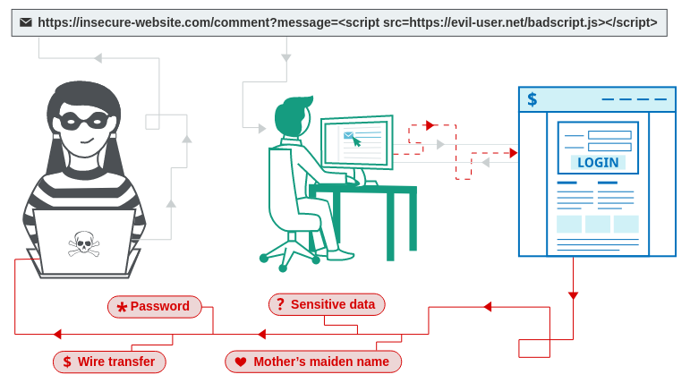
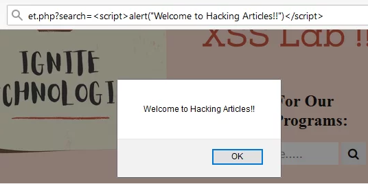
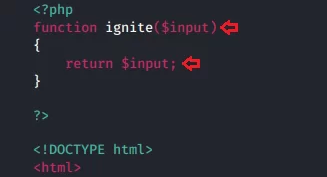
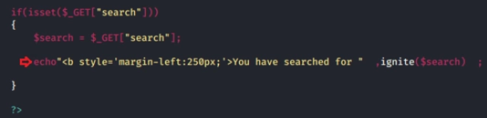
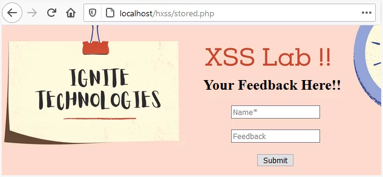
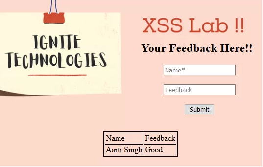
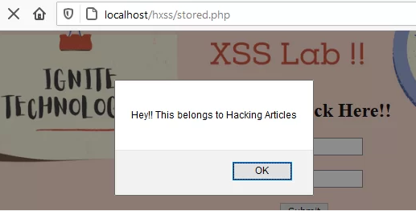
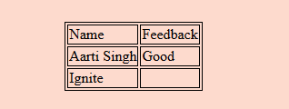
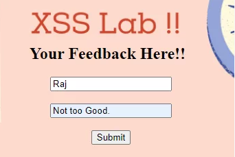
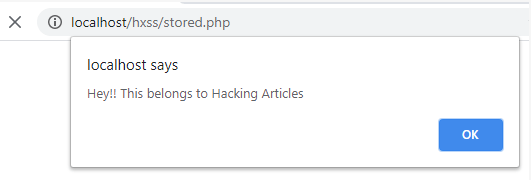

# PortSwigger Academy: Раздел 5. Cross-Site Scripting (XSS)

## Общие сведения об XSS

### 5.1. Что такое XSS
XSS (англ. Cross-Site Scripting — «межсайтовый скриптинг») — тип атаки на веб-системы, заключающийся во внедрении в выдаваемую веб-системой страницу вредоносного кода (который будет выполнен на компьютере пользователя при открытии им этой страницы) и взаимодействии этого кода с веб-сервером злоумышленника. Уязвимость относится к классу инъекций.

Иными словами, данная уязвимость позволяет злоумышленнику внедрять вредоностный код на сайт, причем вредоносный элемент будет впоследствии отображаться и для других пользователей. Опасность заключается в том, что пользователь-жертва, который заходит на сайт, может обнародовать свои данные. Например, на сайте есть вредоносная ссылка, внедренная при эксплуатации данной уязвимости, перейдя по ней, жертва, не заметив подвоха, логинится, при этом данные перехватывает злоумышленник.

### 5.2. Принцип работы XSS
На самом деле, принцип работы мы уже описали выше. Подытожив, можно сказать, что при помощи XSS можно манипулировать веб-ресурсом так, чтобы вредоносный код (JS и другие элементы) отображался у всех пользователей сайта.



### 5.3. Небольшое отступление по лабораторным работам
Все лабораторные работы, которые будут выполнены в данным разделе, в основном будут подтверждаться, если была встроена и выполнена функция alert() в JS. Единственная проблема заключается в том, что Chrome, начиная с версии 92, не позволяет вызывать alert(). Чтобы обойти данную проблему, можно воспользоваться функцией print().

### 5.4. Разновидности XSS
- Reflected XSS - вредоносный код исходит из HTTP-запроса;
- Stored XSS - вредоносный код исходит из БД веб-ресурса;
- DOM-based XSS - существует в коде на стороне клиента, а не в коде на стороне сервера.

#### 5.4.1. Reflected XSS
Reflected XSS — простейшая разновидность межсайтового скриптинга. Он возникает, когда приложение получает данные в HTTP-запросе и включает эти данные в немедленный ответ небезопасным способом. Пример:
```sh
https://insecure-website.com/status?message=All+is+well\

<p>Status: All is well</p>
```
Если в коде выше встраивается простой текст, то в примере ниже уже целенаправленно эксплуатируется XSS:
```sh
https://insecure-website.com/status?message=<script>/*+Bad+stuff+here...+*/</script>

<p>Status: <script>/* Bad stuff here... */</script></p>
```

Еще один пример: была создана веб-страница, которая, таким образом, позволяет пользователю искать конкретный учебный курс. Когда человек ищет “Bug Bounty”, на экране появляется сообщение: “Вы искали Bug Bounty.”


Таким образом, этот мгновенный ответ и параметр “поиск” в URL-адресе показывают, что страница может быть уязвима для XSS, и данные были запрошены с помощью метода GET. Итак, стоит теперь попробовать сгенерировать всплывающие окна, введя Javascript-коды в этот параметр следующим образом:



Отлично!! На приведенном выше скриншоте можно увидеть, что пользователь получил приветственное сообщение. Интересно, почему все так произошло? Необходимо проверить следующий фрагмент кода.



С легкостью выводя сообщение на экран, разработчик не устанавливал никакой проверки ввода в функции ignite, а просто оставил echo для «Search Message» с помощью ignite($search) и переменной «$_GET».



Если пользователь посещает URL-адрес, созданный злоумышленником, сценарий злоумышленника выполняется в браузере пользователя в контексте сеанса этого пользователя с приложением. В этот момент скрипт может выполнять любые действия и извлекать любые данные, к которым у пользователя есть доступ.

##### 5.4.1.1. Влияние Reflected XSS
Помимо всего прочего, злоумышленник может:
- Произвести выполнение любых действий внутри приложения, которые может выполнять пользователь.
- Произвести просмотр любой информации, доступной пользователю.
- Произвести изменение любой информации, которую пользователь способен изменить.
- Инициировать взаимодействие с другими пользователями приложения, в том числе вредоносные атаки, которые, как представляется, исходят от первоначального пользователя-жертвы.

При этом стоит учитывать, что злоумышленнику необходимо "заставить" пользователя проделать определенное действие (сделать запрос на контролируемый злоумышленником веб-ресурс). Это может быть размещение ссылок на веб-сайте, контролируемом злоумышленником, или на другом веб-сайте, который позволяет создавать контент, или путем отправки ссылки по электронной почте, в твиттере или другом сообщении. Данная атака может быть как целенаправленной, так и нецеленаправленной, т.е. влиять на одного или нескольких пользователей.

##### 5.4.1.2. Как обнаружить и протестировать ресурс на наличие Reflected XSS
1. Тестируйте каждую точку входа. Отдельно протестируйте каждую точку входа для данных в HTTP-запросах приложения. Сюда входят параметры или другие данные в строке запроса URL-адреса и тексте сообщения, а также путь к файлу URL-адреса. Он также включает заголовки HTTP, хотя XSS-подобное поведение, которое может быть вызвано только определенными заголовками HTTP, на практике может быть непригодным для использования.
2. Отправьте случайные буквенно-цифровые значения. Для каждой точки входа отправьте уникальное случайное значение и определите, отражено ли это значение в ответе.
3. Определите место внедрения. Это может быть текст между тегами HTML, внутри атрибута тега, который может быть заключен в кавычки, внутри строки JavaScript и т. д.
4. Протестируйте потенциальную полезную нагрузку (payloads). Самый простой способ протестировать полезные нагрузки — отправить запрос в Burp Repeater, изменить запрос, чтобы вставить какую-то полезную нагрузку, отправить запрос, а затем просмотреть ответ, чтобы увидеть, сработала ли полезная нагрузка.
5. Просмотрите альтернативные пути. Если полезная нагрузка XSS была изменена приложением или полностью заблокирована, вам потребуется протестировать альтернативные полезные нагрузки и методы, которые могут обеспечить работающую XSS-атаку.
6. Проведите реальные тесты у себя в браузере.

#### 5.4.2. Stored XSS
Stored XSS еще называется персистентным XSS, так как с помощью этой уязвимости внедренный вредоносный скрипт постоянно хранится внутри сервера базы данных веб-приложения, а сервер далее сбрасывает его обратно, когда пользователь посещает соответствующий веб-сайт.

Это происходит, когда клиент нажимает или наводит курсор на определенный зараженный раздел. Введенный JavaScript будет выполняться браузером так же, как он записан в базе данных приложения, поэтому эта атака не требует какой-либо фишинговой техники для осуществления в отношении пользователей. Наиболее распространенным примером Stored XSS является «опция комментариев» в блогах, которая позволяет любому пользователю оставлять свои отзывы как в виде послания для администратора, так и для других пользователей.

Рассмотрим пример: Веб-приложение просит пользователя оставить свой отзыв, так как на его веб-странице есть два поля ввода: одно – для имени, а другое – для комментария.



Теперь, когда пользователь нажмет кнопку “Отправить”, его запись сохранится в базе данных. Чтобы сделать этот пример более понятным, человек вывел таблицу базы данных на экране следующим образом:



В данном случае разработчик доверяет своим пользователям и не размещает никаких валидаций на полях. Таким образом, эта лазейка была обнаружена злоумышленником, и поэтому он воспользовался ею, так как вместо того, чтобы отправить отзыв, он прокомментировал свой вредоносный скрипт.

```sh
http://localhost/hxss/stored.php
```

На приведенном ниже скриншоте видно, что злоумышленник осуществил желаемое, так как веб-приложение вывело на экран всплывающее предупреждение.



Теперь, вернувшись в базу данных, человек может увидеть, что таблица была обновлена с именем “Ignite”, а поле Feedback – пусто, это проясняет тот факт, что скрипт злоумышленника был успешно введен.



Поэтому стоит переключиться на другой браузер в качестве иного пользователя и снова попытаться отправить подлинный фидбэк.



Теперь, когда пользователь нажмет кнопку «Отправить», браузер выполнит введенный скрипт и отобразит его на экране.



#### 5.4.3. DOM-based XSS


